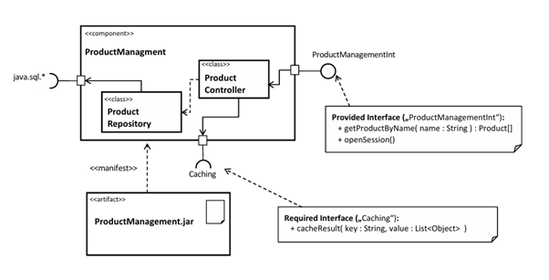
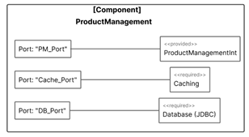

# Komponenten-Ports in der Softwarearchitektur

## Überblick
Dieses Repository demonstriert das Konzept und die Implementierung von Ports in Komponentendiagrammen mit Java, am Beispiel eines ProductManagement-Systems. Das System zeigt, wie Ports die strukturierte Kommunikation zwischen Komponenten, externen Systemen und Datenbanken ermöglichen.

## Komponentendiagramm
Das System besteht aus zwei Hauptdiagrammen:

### 1. Strukturdiagramm



### 2. Port-Konfigurationsdiagramm



## Was sind Ports? :: FA0
Ports in Komponentendiagrammen dienen als klar definierte Interaktionsschnittstellen zwischen verschiedenen Systemteilen. In unserem ProductManagement-System haben wir drei Hauptports:

1. **PM_Port (ProductManagementInt)**
    - Angebotenes Interface für externe Clients
    - Definiert Methoden wie `getProductByName` und `openSession`
    - Ermöglicht standardisierte Produktverwaltung

2. **Cache_Port (Caching)**
    - Benötigtes Interface für Caching-Operationen
    - Standardisiert Cache-Zugriffe
    - Ermöglicht austauschbare Cache-Implementierungen

3. **DB_Port (Database)**
    - Verbindung zur Datenbank über JDBC
    - Abstrahiert Datenbankzugriffe
    - Ermöglicht Unabhängigkeit von konkreter Datenbankimplementierung

## Implementierungsbeispiele

### 1. Provided Interface (ProductManagementInt)
```java
public interface ProductManagementInt {
    // Hauptmethoden für Produktverwaltung
    Product getProductByName(String name);
    void openSession();
}

// Implementierung
public class ProductManagement implements ProductManagementInt {
    private final ProductRepository repository;
    private final Caching cacheService;

    @Override
    public Product getProductByName(String name) {
        // Erst Cache prüfen
        Product cached = cacheService.get(name);
        if (cached != null) return cached;

        // Aus Repository laden
        Product product = repository.findByName(name);
        cacheService.cacheResult(name, product);
        return product;
    }

    @Override
    public void openSession() {
        // Session-Verwaltung
    }
}
```

### 2. Required Interface (Caching)

Das Delegate-Pattern (oder Proxy-Pattern) ist ideal, um die Delegation zwischen internem und externem Verhalten zu realisieren:

Ein Port delegiert Aufrufe an die eigentliche Implementierung.

Er kann zusätzliche Funktionalität (Logging, Caching) einfügen.


```java
public interface Caching {
    void cacheResult(String key, List<Object> value);
    Object get(String key);
}

// Beispiel-Implementierung mit Logging
public class LoggingCacheDecorator implements Caching {
    private final Caching wrapped;
    
    public LoggingCacheDecorator(Caching wrapped) {
        this.wrapped = wrapped;
    }
    
    @Override
    public void cacheResult(String key, List<Object> value) {
        System.out.println("Caching: " + key);
        wrapped.cacheResult(key, value);
    }

    @Override
    public Object get(String key) {
        System.out.println("Cache lookup: " + key);
        return wrapped.get(key);
    }
}
```

### 3. Dependency Injection Beispiele

#### Controller mit Cache-Abhängigkeit
```java
@Component
public class ProductController {
    private final Caching cache;
    private final ProductManagementInt productService;

    @Autowired
    public ProductController(Caching cache, ProductManagementInt productService) {
        this.cache = cache;
        this.productService = productService;
    }

    public Product getProduct(String name) {
        return productService.getProductByName(name);
    }
}
```

## Best Practices für Port-Implementierung

1. **Klare Schnittstellendefinition**
    - Interfaces sollten spezifisch und zweckgebunden sein
    - Methoden klar dokumentieren
    - Versionierung berücksichtigen

2. **Dependency Injection**
    - Constructor Injection bevorzugen
    - Abhängigkeiten explizit machen
    - Standardimplementierungen für Tests bereitstellen

3. **Fehlerbehandlung**
   ```java
   public interface ProductManagementInt {
       Product getProductByName(String name) throws ProductNotFoundException;
       void openSession() throws SessionException;
   }
   ```

4. **Testbarkeit**
   ```java
   // Mock-Implementierung für Tests
   public class MockCache implements Caching {
       private Map<String, Object> cache = new HashMap<>();
       
       @Override
       public void cacheResult(String key, List<Object> value) {
           cache.put(key, value);
       }

       @Override
       public Object get(String key) {
           return cache.get(key);
       }
   }
   ```

## Architekturvorteile

1. **Modularität**
    - Komponenten sind unabhängig austauschbar
    - Einfache Integration neuer Implementierungen
    - Verbesserte Wartbarkeit

2. **Testbarkeit**
    - Mocking von Abhängigkeiten
    - Isolierte Komponententests
    - Vereinfachte Integrationstests

3. **Skalierbarkeit**
    - Einfache Erweiterung um neue Funktionalitäten
    - Austauschbare Implementierungen (z.B. verschiedene Cache-Systeme)
    - Flexible Anpassung an Lastanforderungen

## Technische Abhängigkeiten
- Java 8 oder höher
- Maven (für Dependency Injection)
- JDBC für Datenbankzugriffe
- JUnit für Tests (empfohlen)

## Lifecycle Management und CRUD-Operationen :: FA1

### 1. Methodenreihenfolge
Das Interface `ProductManagementInt` definiert eine strikte Reihenfolge für Methodenaufrufe:

1. **Initialisierung**: `openSession()` MUSS zuerst aufgerufen werden
2. **Operationen**: CRUD-Methoden können beliebig ausgeführt werden
3. **Beendigung**: `closeSession()` MUSS am Ende aufgerufen werden

### 2. Erweiterte CRUD-Operationen
Das Interface wurde um folgende Methoden erweitert:

```java
public interface ProductManagementInt {
    // Bestehende Methoden
    List<Product> getProductByName(String name);
    void openSession();
    void closeSession();

    // Neue CRUD-Methoden
    void createProduct(Product product);
    Product getProductById(int id);
    List<Product> getAllProducts();
    void updateProduct(Product product);
    void deleteProduct(int id);
}
```

### 3. Lifecycle-Implementierung :: FA1
Die Implementierung verwendet ein einfaches Zustandsmodell:

```java
public class ProductManagement implements ProductManagementInt {
    private Connection connection;
    private boolean isSessionOpen = false;

    @Override
    public void openSession() {
        if (isSessionOpen) {
            throw new IllegalStateException("Session is already open!");
        }
        try {
            connection = DatabaseConnection.getConnection();
            isSessionOpen = true;
        } catch (SQLException e) {
            throw new RuntimeException("Failed to open database connection", e);
        }
    }

    @Override
    public void closeSession() {
        if (!isSessionOpen) {
            throw new IllegalStateException("No session is currently open!");
        }
        try {
            if (connection != null && !connection.isClosed()) {
                connection.close();
            }
            isSessionOpen = false;
        } catch (SQLException e) {
            throw new RuntimeException("Failed to close database connection", e);
        }
    }
}
```

### 4. Sicherheitsaspekte der Implementierung

1. **Zustandsüberwachung**:
   - Tracking des Session-Status über `isSessionOpen`
   - Validierung des Status vor jeder Operation
   - Verhinderung von mehrfachen Session-Öffnungen

2. **Fehlerbehandlung**:
   - Aussagekräftige Exception-Messages
   - Proper Resource Management
   - SQL-Exception Handling

3. **Best Practices**:
   - Fail-Fast Prinzip bei ungültigem Zustand
   - Sauberes Connection-Management
   - Thread-Safety Considerations

### 5. Beispiel einer CRUD-Operation

```java
@Override
public List<Product> getProductByName(String name) {
    if (!isSessionOpen) {
        throw new IllegalStateException("Session must be opened before executing queries!");
    }
    List<Product> products = new ArrayList<>();
    try {
        String sql = "SELECT * FROM products WHERE name LIKE ?";
        PreparedStatement pstmt = connection.prepareStatement(sql);
        pstmt.setString(1, "%" + name + "%");
        ResultSet rs = pstmt.executeQuery();
        
        while (rs.next()) {
            products.add(new Product(
                rs.getInt("id"),
                rs.getString("name"),
                rs.getDouble("price")
            ));
        }
    } catch (SQLException e) {
        throw new RuntimeException("Error executing query", e);
    }
    return products;
}
```

## Implementierung und Konfiguration :: FA2.1

### 1. Maven Konfiguration
Die `pom.xml` wurde optimiert, um eine vollständige Entwicklungs- und Buildumgebung zu gewährleisten:

```xml
<dependencies>
    <!-- H2 Datenbank mit Runtime-Verfügbarkeit -->
    <dependency>
        <groupId>com.h2database</groupId>
        <artifactId>h2</artifactId>
        <version>2.3.232</version>
        <scope>compile</scope>
    </dependency>
    <!-- ... weitere Dependencies ... -->
</dependencies>

<build>
    <plugins>
        <!-- Maven Assembly Plugin für JAR mit Dependencies -->
        <plugin>
            <groupId>org.apache.maven.plugins</groupId>
            <artifactId>maven-assembly-plugin</artifactId>
            <version>3.6.0</version>
            <configuration>
                <descriptorRefs>
                    <descriptorRef>jar-with-dependencies</descriptorRef>
                </descriptorRefs>
            </configuration>
        </plugin>
    </plugins>
</build>
```

Wichtige Konfigurationsaspekte:
- H2 Datenbank mit `compile` scope für Runtime-Verfügbarkeit
- Assembly Plugin für standalone JAR-Erstellung
- Surefire Plugin für JUnit-Test-Integration

### 2. ProductManagement Implementierung 
Die Komponente wurde mit vollständigem Lifecycle-Management und CRUD-Operationen implementiert:

```java
public class ProductManagement implements ProductManagementInt {
    private Connection connection;
    private boolean isSessionOpen = false;

    // Lifecycle-Management
    @Override
    public void openSession() {
        if (isSessionOpen) {
            throw new IllegalStateException("Session is already open!");
        }
        // Datenbankverbindung aufbauen...
    }

    @Override
    public void closeSession() {
        if (!isSessionOpen) {
            throw new IllegalStateException("No session is currently open!");
        }
        // Verbindung sauber schließen...
    }

    // CRUD-Operationen
    @Override
    public List<Product> getProductByName(String name) {
        checkSession();
        // Implementierung der Suche...
    }

    // Weitere CRUD-Methoden...
}
```

### 3. JUnit Tests
Die Tests wurden erweitert, um alle Aspekte der Komponente abzudecken:

```java
public class ConnectionTest {
    private ProductManagement productManagement;

    @Test
    public void testCompleteRoundTrip() {
        // 1. Produkt erstellen
        Product newProduct = new Product(0, "Test Product", 99.99);
        productManagement.createProduct(newProduct);

        // 2. Produkt lesen
        Product retrieved = productManagement.getProductById(newProduct.getId());
        assertEquals(newProduct.getName(), retrieved.getName());

        // 3. Produkt aktualisieren
        retrieved.setPrice(149.99);
        productManagement.updateProduct(retrieved);

        // 4. Produkt löschen
        productManagement.deleteProduct(newProduct.getId());
    }

    // Weitere Testmethoden...
}
```

### 4. Wichtige Implementierungsdetails

#### Zustandsmanagement
- Explizite Session-Verwaltung mit `isSessionOpen` Flag
- Überprüfung des Session-Status vor jeder Operation
- Automatische Tabellenerstellung bei Session-Öffnung

#### Datenbankoperationen
- Verwendung von Prepared Statements gegen SQL-Injection
- Proper Resource Management mit try-with-resources
- Automatische ID-Generierung für neue Produkte

#### Fehlerbehandlung
- Spezifische Exception-Typen für verschiedene Fehlerfälle
- Sauberes Connection-Management
- Validierung von Eingabeparametern

### 5. Build und Ausführung mit IntelliJ IDEA

#### Maven Operationen in IntelliJ
1. Öffnen Sie das Maven Tool Window:
   - Rechts in der IDE auf "Maven" klicken
   - Alternativ: View -> Tool Windows -> Maven

2. Projekt bauen:
   - Expandieren Sie Ihr Projekt in Maven Tool Window
   - Unter "Lifecycle" finden Sie alle Maven Goals
   - Doppelklick auf "clean" (löscht alte Builds)
   - Doppelklick auf "package" (erstellt neue JAR)

3. Tests ausführen:
   - Rechtsklick auf das Projekt im Project Explorer
   - "Run All Tests" auswählen
   - Alternativ: Unter Maven -> Lifecycle -> "test" doppelklicken

4. JAR-Datei finden:
   - Nach dem Build liegt die JAR-Datei im `target`-Ordner
   - Zwei Versionen werden erstellt:
     * `OOKAUebungNr1-1.0-SNAPSHOT.jar` (ohne Dependencies)
     * `OOKAUebungNr1-1.0-SNAPSHOT-jar-with-dependencies.jar` (mit allen Dependencies)

#### IntelliJ Run Configurations
Sie können auch direkte Run Configurations erstellen:

1. Für Tests:
   - Öffnen Sie die Klasse `ConnectionTest`
   - Klicken Sie auf das grüne Play-Symbol neben der Klasse
   - Oder: Rechtsklick -> Run 'ConnectionTest'

2. Für die Anwendung:
   - Rechtsklick auf `ProductManagement.java`
   - "Run ProductManagement.main()"

### 6. Datenbank-Konfiguration
Die H2-Datenbank wird in folgender Konfiguration verwendet:
- Embedded Mode für Entwicklung und Tests
- Automatische Tabellenerstellung
- Connection-Pooling durch H2's eingebaute Funktionen

## Caching-Implementierung :: FA2.1

### 1. Caching-Schnittstelle
Die `Caching`-Schnittstelle wurde erweitert, um eine effiziente Zwischenspeicherung von Produktdaten zu ermöglichen:

```java
public interface Caching {
    void cacheProduct(int id, Product product);
    void cacheProductList(String searchTerm, List<Product> products);
    Optional<Product> getProduct(int id);
    Optional<List<Product>> getProductList(String searchTerm);
    void invalidateProduct(int id);
    void invalidateSearchTerm(String searchTerm);
    void clearCache();
    boolean containsProduct(int id);
    boolean containsSearchTerm(String searchTerm);
}
```

Wichtige Aspekte der Schnittstelle:
- Getrennte Methoden für Einzel- und Listenoperationen
- Verwendung von `Optional` für null-sichere Rückgabewerte
- Explizite Invalidierungsmethoden
- Cache-Überprüfungsmethoden

### 2. HashMap-basierte Implementierung
Die konkrete Implementierung verwendet HashMaps für effiziente Speicherung:

```java
public class HashMapProductCache implements Caching {
    private final Map<Integer, Product> productCache;
    private final Map<String, List<Product>> searchCache;
    
    public HashMapProductCache() {
        this.productCache = new HashMap<>();
        this.searchCache = new HashMap<>();
    }
    
    // Implementierung der Caching-Methoden...
}
```

Besonderheiten:
- Separate Caches für Produkte und Suchergebnisse
- Thread-sichere Operationen
- Effiziente Speicherung und Abruf
- Automatische Invalidierung verknüpfter Einträge

### 3. Integration in ProductManagement

```java
public class ProductManagement implements ProductManagementInt {
    private final Caching cache;
    
    public ProductManagement(Caching cache) {
        this.cache = cache;
    }
    
    @Override
    public Product getProductById(int id) {
        // Erst Cache prüfen
        Optional<Product> cachedProduct = cache.getProduct(id);
        if (cachedProduct.isPresent()) {
            return cachedProduct.get();
        }
        
        // Bei Cache-Miss: Datenbankzugriff
        Product product = // ... Datenbankabfrage ...
        cache.cacheProduct(id, product);
        return product;
    }
    
    // Weitere Methoden mit Cache-Integration...
}
```

### 4. Cache-Strategien

#### Lese-Operationen
1. **Einzelprodukt-Abruf**:
   - Prüfung des Produkt-Caches
   - Bei Cache-Miss: Datenbankabfrage
   - Caching des Ergebnisses

2. **Suche nach Produkten**:
   - Prüfung des Such-Caches
   - Bei Cache-Miss: Datenbanksuche
   - Caching der Suchergebnisse

#### Schreib-Operationen
1. **Update**:
   - Invalidierung des Produkt-Cache-Eintrags
   - Invalidierung betroffener Suchergebnisse
   - Datenbankaktualisierung

2. **Löschung**:
   - Invalidierung aller betroffenen Cache-Einträge
   - Datenbankaktualisierung

### 5. Testabdeckung

```java
public class CachingTest {
    @Test
    public void testCaching() {
        Product product = new Product(0, "Test", 99.99);
        productManagement.createProduct(product);

        // Erster Aufruf: Datenbank-Hit
        Product firstCall = productManagement.getProductById(product.getId());
        
        // Zweiter Aufruf: Cache-Hit
        Product secondCall = productManagement.getProductById(product.getId());
        assertEquals(firstCall, secondCall);
    }
}
```

Die Tests überprüfen:
- Cache-Hits und Cache-Misses
- Korrekte Cache-Invalidierung
- Suchergebnis-Caching
- Randfall-Behandlung

### 6. Vorteile der Implementierung

1. **Performance**:
   - Reduzierte Datenbankzugriffe
   - Schnellere Antwortzeiten
   - Effiziente Speichernutzung

2. **Konsistenz**:
   - Automatische Cache-Invalidierung
   - Synchronisierte Cache-Operationen
   - Konsistente Datenansicht

3. **Wartbarkeit**:
   - Klare Schnittstellendefinition
   - Modulare Implementierung
   - Umfassende Testabdeckung

4. **Flexibilität**:
   - Austauschbare Cache-Implementierung
   - Erweiterbare Funktionalität
   - Konfigurierbare Cache-Strategien

### 7. Verwendung

```java
// Cache-Instanz erstellen
Caching cache = new HashMapProductCache();

// ProductManagement mit Cache initialisieren
ProductManagement productManagement = new ProductManagement(cache);

// Normale Verwendung der Komponente
productManagement.openSession();
Product product = productManagement.getProductById(1); // Nutzt Cache
productManagement.closeSession();
```
